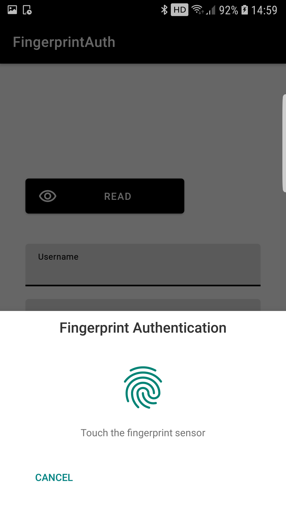

# Android Fingerprint Auth

[](https://jitpack.io/#pisalcoding/android-fingerprint-auth)

The legacy fingerprint authentication using Fingerprint Manager with the new AndroidX MasterKey.
<div style="text-align:center; width: 100%;">
   
</div>

## Usage

> Step 1: Add this your root build.gradle
```groovy
repositories {  
	...
    maven { url "https://jitpack.io" }
}

```
> Step 2: Add this your app build.gradle
```groovy
dependencies {
    implementation 'com.github.pisalcoding:fingerprint-auth:1.0.0'
}
```

> Step 3: Usage
```kotlin
class MainActivity : AppCompatActivity() {

    private fun authenticate(
        doOnSuccess: BiometricSuccessBlock,
        doOnFailure: BiometricFailureBlock,
    ) {
        val fingerprintFragment = FingerprintDialogFragment.newInstance()
        FingerprintAuth.from(this)
            .withDialogView(fingerprintFragment)
            .doOnSuccess {
                Log.d("FingerprintAuth", "Successful!. Here you can access encrypted sharedpreference wrapped in CredentailsKeeper.")
                doOnSuccess(this)
            }
            .doOnFailure {
                Log.d("FingerprintAuth", "Failed: $it")
                doOnFailure(it)
            }
            .authenticate()
    }
}


data class Credentials(
    val username: String,
    val pin: String,
) : ICredentials
```

For more details, check the sample 'app'.

